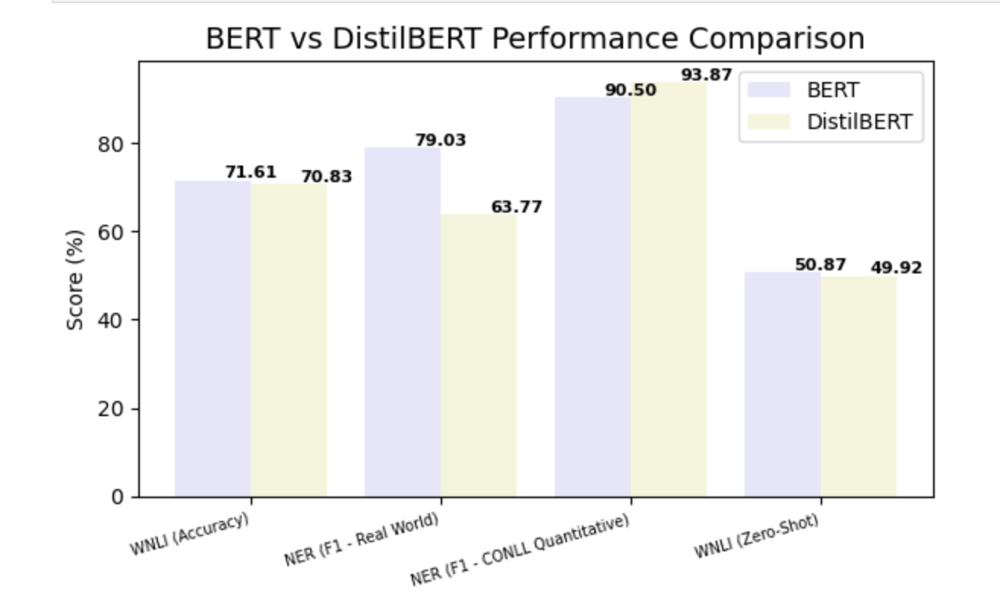

# Bert-distilBERT-comparison-WNLI-NER
Comparative analysis of BERT and DistilBERT on WNLI and NER tasks

## Model Distillation Overview

Model distillation has become a vital technique for compressing large transformer models such as BERT into smaller, faster variants like DistilBERT. The original [DistilBERT paper](https://arxiv.org/abs/1910.01108) demonstrated  97% of BERT’s accuracy across several NLP benchmarks, and notably reported that DistilBERT outperformed BERT on one task — the Winograd Natural Language Inference (WNLI) task. Motivated by this claim,  WNLI task is re-examined using both zero-shot and fine-tuned approaches and observed inconsistent results in both models, contrasting with the original findings.

In addition,  Named Entity Recognition (NER) is examined, a task not covered in the original DistilBERT paper, due to its practical importance and the availability of smaller, structured datasets. DistilBERT performed reliably on NER, with fine-tuning yielding better results, and the F1-score offering a more informative evaluation than accuracy alone. These findings emphasize both the strengths and limitations of model distillation across different NLP challenges.

---

## 1. Fine-tuning BERT on WNLI

Here implemented  fine-tuning of the pre-trained BERT model using the Hugging Face Transformers library. The code loads the WNLI dataset, tokenizes input sentence pairs with the BERT tokenizer, and trains the model for 5 epochs using the Trainer API. Training progress is logged every 10 steps, and accuracy metrics are recorded. The highest training accuracy observed was at step 320, reaching **0.7161**. The WNLI dataset was accessed directly from the Hugging Face datasets library by loading the GLUE benchmark’s WNLI subset.

[View the fine-tuning BERT code here](https://github.com/ayperiKhudaybergenova/bert-distilbert-comparison-WNLI-NER/blob/main/bert_wnli_finetune.py)

---

## 2. Fine-tuning DistilBERT on WNLI

Fine-tuned  DistilBERT model on the Winograd Natural Language Inference (WNLI) task using the Hugging Face `transformers` and `datasets` libraries. The WNLI data was accessed from the GLUE benchmark via `load_dataset()`. After tokenizing the sentence pairs with `AutoTokenizer`,  Hugging Face Trainer API to train the model for 5 epochs, logging the training loss every 10 steps. The model successfully completed 400 steps, and performance was monitored using training loss and accuracy. Notably, the accuracy peaked at both step 20 and step 320 with a value of **0.7083**, indicating some inconsistency during training.

[View the fine-tuning DistilBERT code here](https://github.com/ayperiKhudaybergenova/bert-distilbert-comparison-WNLI-NER/blob/main/distilBERT_wnli_finetuned.py)

---

## 3. Named Entity Recognition (NER) with BERT and DistilBERT

This project compares the performance of two transformer models — BERT and DistilBERT — on the task of Named Entity Recognition (NER). Both models were not manually fine-tuned but loaded directly from the Hugging Face model hub as already fine-tuned versions:

* [`dslim/bert-base-NER`](https://huggingface.co/dslim/bert-base-NER) (BERT fine-tuned on CoNLL-2003)
* [`elastic/distilbert-base-uncased-finetuned-conll03-english`](https://huggingface.co/elastic/distilbert-base-uncased-finetuned-conll03-english) (DistilBERT fine-tuned on CoNLL-2003)

The analysis includes:

1. Qualitative analysis: comparing named entities detected on **Real-world test sentences.**

Results show BERT achieving higher F1 and accuracy scores, while DistilBERT offers faster inference and acceptable trade-offs for lightweight applications.

* BERT F1 Score: 79.03%
* DistilBERT F1 Score: 63.77%

[View the NER comparison code here](https://github.com/ayperiKhudaybergenova/bert-distilbert-comparison-WNLI-NER/blob/main/bert%2CdistilBERT_NER_finetuned.py)

---

##  4. Zero-shot Evaluation of Pre-trained Models on WNLI

This project evaluates zero-shot performance of pre-trained language models on the WNLI (Winograd Natural Language Inference) dataset.  A CSV file is used (`train_complete.csv`) stored in local Google Drive and accessed it through Google Colab. The dataset contains premise-hypothesis pairs with labels indicating entailment. Two models — `bert-base-uncased` and `distilbert-base-uncased` — were used without any fine-tuning, meaning they were applied as-is (zero-shot) to evaluate their performance on the WNLI task. The data was tokenized and fed into each model, and predictions were compared with true labels using accuracy as the evaluation metric.

* Zero-shot accuracy on WNLI (DistilBERT): 0.4992
* Zero-shot accuracy on WNLI (BERT): 0.5087

[View the zero-shot evaluation code here](https://github.com/ayperiKhudaybergenova/bert-distilbert-comparison-WNLI-NER/blob/main/bert%2CdistilBERT_wnli_zeroshot.py)

Even though DistilBERT performs slightly lower than BERT in some tasks like NER and WNLI, it still retains around 97% of BERT’s performance while being significantly smaller and faster. Depending on your task requirements — whether accuracy or efficiency is the priority — **either model can be the better choice**.

👥 Contributors

- **Ayperi Khudaybergenova** — implementation, experiments, analysis  
- ** ** — conceptual guidance, research direction  
- **Mario Kuzmanov** — code review and debugging support

